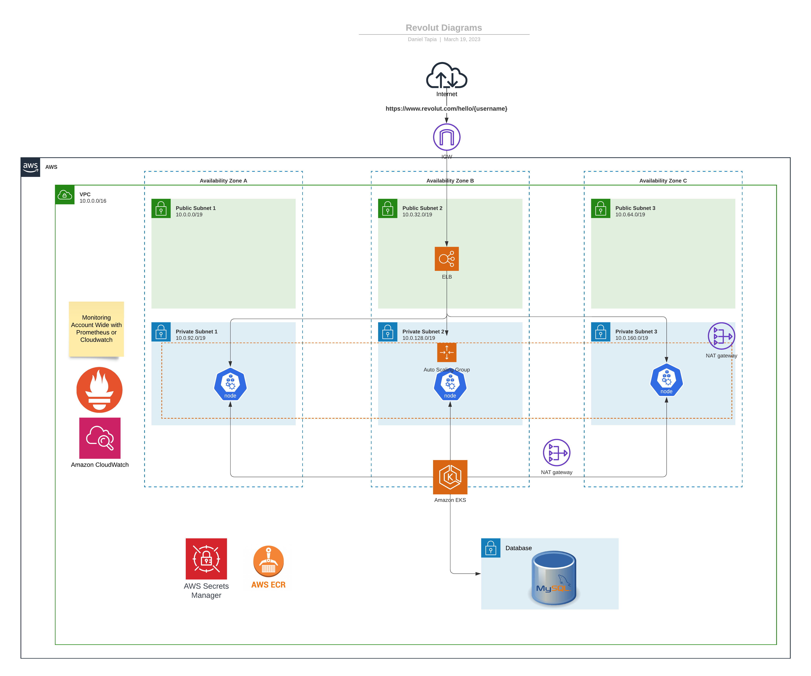
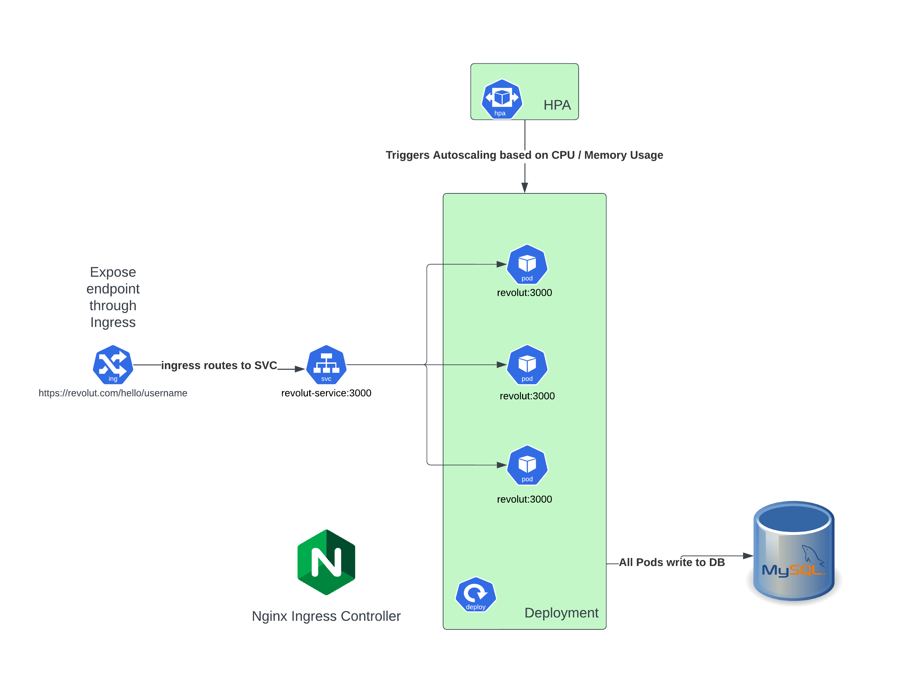
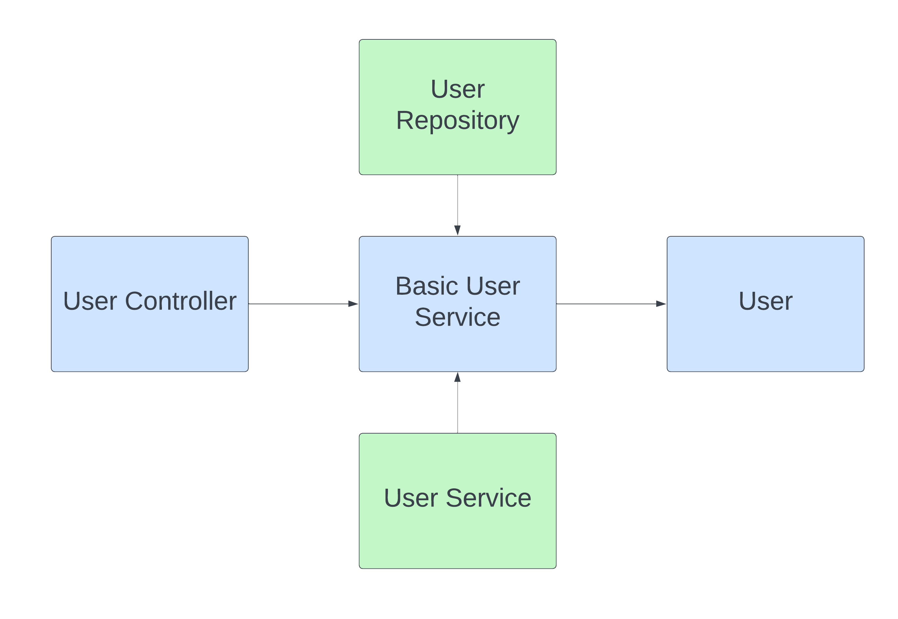
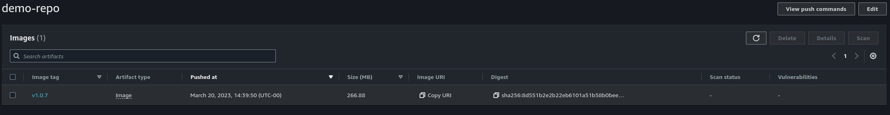

# revolut-interview

# Prerequistes

### Gradle 7.4.2

```bash
$ gradle --version
Build time:   2022-03-31 15:25:29 UTC
Revision:     540473b8118064efcc264694cbcaa4b677f61041

Kotlin:       1.5.31
Groovy:       3.0.9
Ant:          Apache Ant(TM) version 1.10.11 compiled on July 10 2021
JVM:          17.0.6 (Private Build 17.0.6+10-Ubuntu-0ubuntu122.04)
OS:           Linux 5.19.0-35-generic amd64

```
### Java 17.0.6
```bash
java --version
openjdk 17.0.6 2023-01-17
OpenJDK Runtime Environment (build 17.0.6+10-Ubuntu-0ubuntu122.04)
OpenJDK 64-Bit Server VM (build 17.0.6+10-Ubuntu-0ubuntu122.04, mixed mode, sharing)
```

### Docker 23.0.1
```bash 
docker --version
Docker version 23.0.1, build a5ee5b1

```
# Architecture Diagram


# Kubernetes Diagram



# Build

```bash
docker build -t revolut .
[+] Building 79.8s (15/15) FINISHED
 => [internal] load .dockerignore                                                                                                                                                                                                                                                                                    0.0s
 => => transferring context: 2B                                                                                                                                                                                                                                                                                      0.0s
 => [internal] load build definition from Dockerfile                                                                                                                                                                                                                                                                 0.1s
 => => transferring dockerfile: 629B                                                                                                                                                                                                                                                                                 0.0s
 => [internal] load metadata for docker.io/library/openjdk:19-jdk-slim-buster                                                                                                                                                                                                                                        1.2s
 => [internal] load metadata for docker.io/library/gradle:7.4.2-jdk17                                                                                                                                                                                                                                                1.2s
 => [auth] library/openjdk:pull token for registry-1.docker.io                                                                                                                                                                                                                                                       0.0s
 => [auth] library/gradle:pull token for registry-1.docker.io                                                                                                                                                                                                                                                        0.0s
 => [builder 1/4] FROM docker.io/library/gradle:7.4.2-jdk17@sha256:ce56c8bbe223806848aee26c58d05d3d797049a67b22d8a80fbb5af93e958e18                                                                                                                                                                                  0.0s
 => [internal] load build context                                                                                                                                                                                                                                                                                    0.0s
 => => transferring context: 810.62kB                                                                                                                                                                                                                                                                                0.0s
 => [app 1/3] FROM docker.io/library/openjdk:19-jdk-slim-buster@sha256:57d0f787479c6783724326fd1167be7591b8ae9248af7655bbb721cb49334013                                                                                                                                                                              0.0s
 => CACHED [builder 2/4] WORKDIR /app                                                                                                                                                                                                                                                                                0.0s
 => [builder 3/4] COPY . /app                                                                                                                                                                                                                                                                                        0.2s
 => [builder 4/4] RUN gradle bootJar                                                                                                                                                                                                                                                                                77.8s
 => CACHED [app 2/3] WORKDIR /app                                                                                                                                                                                                                                                                                    0.0s
 => [app 3/3] COPY --from=builder /app/build/revolut-0.0.1-SNAPSHOT.jar /app/app.jar                                                                                                                                                                                                                                 0.1s
 => exporting to image                                                                                                                                                                                                                                                                                               0.2s
 => => exporting layers                                                                                                                                                                                                                                                                                              0.2s
 => => writing image sha256:f293b10be542fa017a51974f3ba1f0c00e2aab8b559c4e880f8de699685cfffd                                                                                                                                                                                                                         0.0s
 => => naming to docker.io/library/revolut
```


# Considerations
- &#9745; Terraform
- &#9745; Application Rest API
- &#9745; Helm Chart
- &#9745; Docker Compose
- &#9745; CI Pipeline
- &#9745; CD Pipeline
- &#9746; Unit Test

Due to time constraints and knowledge gap I couldn't accomplish the unit testing, but I do understand the fundamentals from an infrastructure and provisioning perspective.

The application is deployed on a EKS Kubernetes Cluster, the deployment is highly available, one pod in every region of us-east-1, this allows for rolling upgrades through helm to occurs without downtime. 
The database is a simple mysql, but in a production environment it would have to deployed in a cluster configuration allowing multiple read nodes and one write node to allow for faster reads and bottlenecks of database connections can be avoided as much as possible.
If high traffic is incoming into the application, a redis cluster can be considered as well to track the most queried users and have them readily available so we don't overload the database.

The main pipelines are CI/CD where as CI is used to build the application and push it to a remote repository, I've set it up in such a way that git tags are used to keep the repo in version control and deployments are used with git tags such as `v1.0.1`, there is a github action whose purpose is to bump the version on every merge to main
Of course since I couldn't finish the unit testing, this is the step where we would run tests on every commit to the branch and fail the pipeline if there were any errors, again this is possible but ran out of time.


# Application

The application is written in spring boot 3.1 since I have some experience from back in the day when I was a software developer.
The basic way the data is process is an MVC controller where the routes are handled by `UserController.java` and calls a service layer `BasicUserService.java` which implements `UserService.java` interface to finally store data using JPA the Entity `User.java` into the database.
The database used was mysql just because it was the simplest and easy to use out of the box with spring boot, also the application described doesn't have high throughput requirements.



I've also extended `ResponseEntityExceptionHandler` to handle the `handleConstraintViolationException` so I can get custom validation on the birthday date.

# Testing

Testing is something I failed to accomplish, junit has changed a lot during the time when I worked with it, I tried some attempts but ran out of time, I know how to do it if I had more time to investigate

## Sample Tests
```bash
❯ curl -X PUT --header "Content-Type: application/json" localhost:3000/hello/testuser --data '{ "dateOfBirth": "2023-03-18" }'
~
❯ curl -X PUT --header "Content-Type: application/json" localhost:3000/hello/testuser2 --data '{ "dateOfBirth": "2023-03-18" }'
{"username":"must match \"[a-zA-Z]+\""}
~
❯ curl -X PUT --header "Content-Type: application/json" localhost:3000/hello/testuser2 --data '{ "dateOfBirth": "2024-03-18" }'
{"dateOfBirth":"must be a past date","username":"must match \"[a-zA-Z]+\""}
~
❯ curl -X PUT --header "Content-Type: application/json" localhost:3000/hello/testuser --data '{ "dateOfBirth": "2024-03-18" }'
{"dateOfBirth":"must be a past date"}
~
❯ curl -X GET --header "Content-Type: application/json" localhost:3000/hello/testuser
{ “message”: “Hello, testuser! Your birthday is in 364day(s)}
❯ curl -X PUT --header "Content-Type: application/json" localhost:3000/hello/newtestuser --data '{ "dateOfBirth": "1990-03-19" }'

~
❯ curl -X GET --header "Content-Type: application/json" localhost:3000/hello/newtestuser
{ “message”: “Hello, newtestuser! Happy Birthday


```

# Dockerfile

The dockerfile is split into 3 different builds:
- Cache Layer
- Build Layer
- Application Layer

## Cache Layer
The first one is the cache layer, that helps cache the gradle downloads, it will download all dependencies on the first run but subsequent ones are cached and docker layers saves this so future builds are faster as can be shown by the following subsequent builds.

```bash
docker build -t revolut .
[+] Building 283.2s (20/20) FINISHED
 => [internal] load .dockerignore                                                                                                                     0.0s
 => => transferring context: 2B                                                                                                                       0.0s
 => [internal] load build definition from Dockerfile                                                                                                  0.1s
 => => transferring dockerfile: 652B                                                                                                                  0.0s
 => [internal] load metadata for docker.io/library/openjdk:19-jdk-slim-buster                                                                         1.0s
 => [internal] load metadata for docker.io/library/gradle:7.4.2-jdk17                                                                                 1.0s
 => [auth] library/openjdk:pull token for registry-1.docker.io                                                                                        0.0s
 => [auth] library/gradle:pull token for registry-1.docker.io                                                                                         0.0s
 => CACHED [builder 1/5] FROM docker.io/library/gradle:7.4.2-jdk17@sha256:ce56c8bbe223806848aee26c58d05d3d797049a67b22d8a80fbb5af93e958e18            0.0s
 => [internal] load build context                                                                                                                     0.1s
 => => transferring context: 66.81kB                                                                                                                  0.0s
 => [app 1/3] FROM docker.io/library/openjdk:19-jdk-slim-buster@sha256:57d0f787479c6783724326fd1167be7591b8ae9248af7655bbb721cb49334013               0.0s
 => CACHED [cache 2/5] RUN mkdir -p /home/gradle/cache_home                                                                                           0.0s
 => CACHED [cache 3/5] WORKDIR /app                                                                                                                   0.0s
 => [cache 4/5] COPY . /app                                                                                                                           0.7s
 => [cache 5/5] RUN gradle clean build -i --stacktrace                                                                                              274.7s
 => [builder 2/5] COPY --from=cache /home/gradle/cache_home /home/gradle/.gradle                                                                      0.3s
 => [builder 3/5] WORKDIR /app                                                                                                                        0.1s
 => [builder 4/5] COPY . /app                                                                                                                         0.7s
 => [builder 5/5] RUN gradle bootJar                                                                                                                  4.7s
 => CACHED [app 2/3] WORKDIR /app                                                                                                                     0.0s
 => [app 3/3] COPY --from=builder /app/build/revolut-0.0.1-SNAPSHOT.jar /app/app.jar                                                                  0.1s
 => exporting to image                                                                                                                                0.2s
 => => exporting layers                                                                                                                               0.2s
 => => writing image sha256:3afcd01ed881e74ec4431e0e56c1a5621474d821d05d6eb8e779c4120118e080                                                          0.0s
 => => naming to docker.io/library/revolut                                                                                                            0.0s

~/Documents/interviews/revolut-interview main* 4m 43s
❯ docker build -t revolut .
[+] Building 110.2s (20/20) FINISHED
 => [internal] load .dockerignore                                                                                                                     0.0s
 => => transferring context: 2B                                                                                                                       0.0s
 => [internal] load build definition from Dockerfile                                                                                                  0.1s
 => => transferring dockerfile: 660B                                                                                                                  0.0s
 => [internal] load metadata for docker.io/library/openjdk:19-jdk-slim-buster                                                                         1.0s
 => [internal] load metadata for docker.io/library/gradle:7.4.2-jdk17                                                                                 1.0s
 => [auth] library/openjdk:pull token for registry-1.docker.io                                                                                        0.0s
 => [auth] library/gradle:pull token for registry-1.docker.io                                                                                         0.0s
 => [internal] load build context                                                                                                                     0.0s
 => => transferring context: 78.71kB                                                                                                                  0.0s
 => [app 1/3] FROM docker.io/library/openjdk:19-jdk-slim-buster@sha256:57d0f787479c6783724326fd1167be7591b8ae9248af7655bbb721cb49334013               0.0s
 => CACHED [cache 1/5] FROM docker.io/library/gradle:7.4.2-jdk17@sha256:ce56c8bbe223806848aee26c58d05d3d797049a67b22d8a80fbb5af93e958e18              0.0s
 => CACHED [cache 2/5] RUN mkdir -p /home/gradle/cache_home                                                                                           0.0s
 => CACHED [cache 3/5] WORKDIR /app                                                                                                                   0.0s
 => [cache 4/5] COPY . /app                                                                                                                           0.7s
 => [cache 5/5] RUN gradle clean build -x test -i --stacktrace                                                                                      101.8s
 => [builder 2/5] COPY --from=cache /home/gradle/cache_home /home/gradle/.gradle                                                                      0.3s
 => [builder 3/5] WORKDIR /app                                                                                                                        0.1s
 => [builder 4/5] COPY . /app                                                                                                                         0.7s
 => [builder 5/5] RUN gradle bootJar                                                                                                                  4.6s
 => CACHED [app 2/3] WORKDIR /app                                                                                                                     0.0s
 => [app 3/3] COPY --from=builder /app/build/revolut-0.0.1-SNAPSHOT.jar /app/app.jar                                                                  0.2s
 => exporting to image                                                                                                                                0.2s
 => => exporting layers                                                                                                                               0.2s
 => => writing image sha256:7585b4822d43a820ee930f3a11772ad8f160c245f4fa6b8207da61c4c37e35ba                                                          0.0s
 => => naming to docker.io/library/revolut                                                                                                            0.0s


```

## Build Layer
The build layer also uses the same `FROM gradle:7.4.2-jdk17` and generates the jar artifact that will be passed on to the final application layer

## Application Layer

The final layer is the application layer and I change the base image from `gradle:7.4.2-jdk17` -> `openjdk:17-jdk-slim-buster` to reduce final image size, I didn't want to use `alpine` base images even though they take a lot less space they have issues with networking with DNS over TCP and since I plan to deploy this on Kubernetes I want to avoid using alpine images to keep environment drifts to a minimum. 
Again we copy the jar from the previous step and copy it on the app layer and execute it with: 
```dockerfile
COPY --from=builder /app/build/revolut-0.0.1-SNAPSHOT.jar /app/app.jar
ENTRYPOINT ["java","-jar","/app/app.jar"]
```

# Terraform

I'm using `terraform-aws-modules` providers since they have great compatability between the different resources such as EKS / VPC / IAM etc.

## VPC

The VPC is segmented into 3 Private Subnets and 3 Public Subnets

```terraform
  private_subnets = ["10.0.0.0/19", "10.0.32.0/19", "10.0.64.0/19"]
  public_subnets  = ["10.0.96.0/19", "10.0.128.0/19", "10.0.160.0/19"]
  ```

I chose a `/19` network since it can hosts roughly 8190 pods on each subnet which is a good number on every subnet, private network is for database and pod deployment and the public network is for CDNs and Public Load Balancers and ALBs


## Backend

The backend is commented so you can run this on your local machine but I left what I think is the proper way of doing it which is an s3 bucket and dynamodb to handle the state file

```terraform
   backend "s3" {
     encrypt        = true
     bucket         = "revolut-terraform-state-poc"
     dynamodb_table = "terraform-state-lock"
     key            = "staging/us-east-1/cluster/eks"
     region         = "us-east-1"
     profile        = "revolut"
   }
```

## Node Groups

`node-group.tf` holds the configuration for the EKS cluster and the configmap for `aws-auth` is configured to be managed by terraform instead of EKS since this file is detrimental to handling the access to the cluster to developers. 


# Docker Compose

To run the application for local development in its entirety I run docker compose, create a network layer in bridge mode and just a simple docker build of the current code and use a mysql image `mysql:5.7`


# Kubernetes

To deploy the application I've created a helm chart that will deploy the following resources

- Deployment
- HPA
- Service
- Ingress

This does expect some sort of ingress controller already installed in the cluster, for example purposes I use nginx ingress controller but anything else can be used and the `ingres.yaml` would have to be changed accordingly

The manual deployment can be executed by running 
```bash
helm install revolut chart
```

This will deploy the contents of the helm chart into kubernetes, the `values.yaml` will have to be modified to use the ECR repository URL
```yaml
image:
  repository: 563547372653.dkr.ecr.us-east-1.amazonaws.com/demo-repo
  pullPolicy: IfNotPresent
  # Overrides the image tag whose default is the chart appVersion.
  tag: "v1.0.1"
```

I've attached also an ECR directory that can be deployed via terraform to deploy this as well, a succesful upload through the CI pipeline can be seen here



